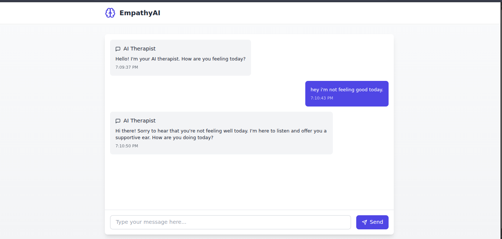
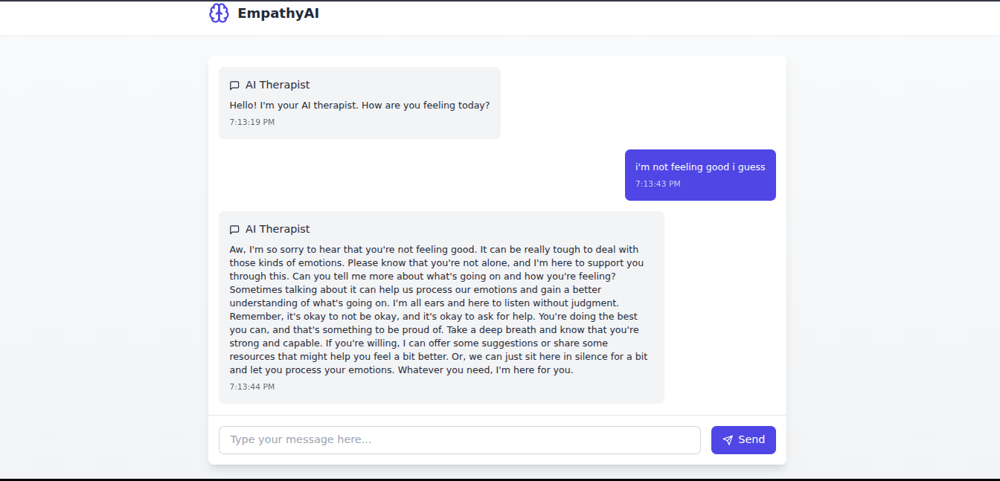

# EmpathyAI - AI Therapy Chatbot

EmpathyAI is a full-stack web application that provides AI-powered therapeutic conversations. Built with React (frontend) and Python FastAPI (backend), it offers a clean, intuitive interface for users to interact with an AI therapist powered by Groq's LLaMA model.

## 🏗️ Project Structure

```
empathyai/
├── backend/
│   ├── __pycache__/
│   ├── app.py                 # FastAPI application entry point
│   ├── main.py                # Core chatbot processing logic
│   ├── README.md
│   ├── requirements.txt       # Python dependencies
│   ├── template.py           # Prompt template handling
│   ├── tools.yaml           # Configuration for AI tools
│   ├── venv/                # Python virtual environment
│   └── yaml_utils.py        # YAML utility functions
└── frontend/
    ├── eslint.config.js
    ├── index.html
    ├── node_modules/
    ├── package-lock.json
    ├── package.json
    ├── pnpm-lock.yaml
    ├── postcss.config.js
    ├── public/
    ├── src/
    │   ├── tailwind.config.js
    │   ├── tsconfig.app.json
    │   ├── tsconfig.json
    │   └── tsconfig.node.json
    └── vite.config.ts
```

## 📸 Screenshots

### Application Interface

*Main chat interface with AI therapist*


*Example therapeutic conversation*


## 🚀 Features

- **Real-time AI Conversations**: Engage in therapeutic conversations with an AI powered by Groq's LLaMA model
- **Memory Management**: The AI maintains conversation context with a configurable memory buffer
- **Modern UI**: Clean, responsive React interface with Tailwind CSS styling
- **TypeScript Support**: Full TypeScript implementation for better development experience
- **Error Handling**: Comprehensive error handling on both frontend and backend
- **Conversation History**: Messages are timestamped and stored during the session

## 🛠️ Installation & Setup

### Prerequisites

- Node.js (v16 or higher)
- Python (v3.8 or higher)
- npm, yarn, or pnpm package manager
- Groq API Key

### Backend Setup

1. **Navigate to the backend directory:**
   ```bash
   cd backend
   ```

2. **Create and activate a virtual environment:**
   ```bash
   python -m venv venv
   
   # On Windows
   venv\Scripts\activate
   
   # On macOS/Linux
   source venv/bin/activate
   ```

3. **Install Python dependencies:**
   ```bash
   pip install -r requirements.txt
   ```

4. **Set up environment variables:**
   Create a `.env` file in the backend directory:
   ```env
   GROQ_API_KEY=your_groq_api_key_here
   CHAT_MODEL_NAME=llama3-8b-8192
   ```

5. **Configure tools (optional):**
   Modify `tools.yaml` to customize the AI's behavior and available tools.

### Frontend Setup

1. **Navigate to the frontend directory:**
   ```bash
   cd frontend
   ```

2. **Install dependencies:**
   ```bash
   # Using npm
   npm install
   
   # Using yarn
   yarn install
   
   # Using pnpm
   pnpm install
   ```

## 🏃‍♂️ Running the Application

### Start the Backend Server

1. **Make sure you're in the backend directory with the virtual environment activated:**
   ```bash
   cd backend
   source venv/bin/activate  # On Windows: venv\Scripts\activate
   ```

2. **Run the FastAPI server:**
   ```bash
   python app.py
   ```
   
   The backend server will start on `http://localhost:8000`

### Start the Frontend Development Server

1. **Open a new terminal and navigate to the frontend directory:**
   ```bash
   cd frontend
   ```

2. **Start the development server:**
   ```bash
   # Using npm
   npm run dev
   
   # Using yarn
   yarn dev
   
   # Using pnpm
   pnpm dev
   ```
   
   The frontend application will be available at `http://localhost:5173` (or another port if 5173 is occupied)

### Testing the Backend Standalone

You can also test the chatbot logic directly from the command line:

```bash
cd backend
python main.py
```

This will start a simple command-line interface where you can chat with the AI directly.

## 📡 API Endpoints

The backend provides the following API endpoints:

- `POST /chat` - Send a message to the AI therapist
  - Request body: `{ "message": "your message here" }`
  - Response: `{ "response": "AI response" }`


## 🔧 Configuration

### Backend Configuration

- **Model Selection**: Change the `CHAT_MODEL_NAME` in your `.env` file to use different Groq models
- **Memory Length**: Modify `conversational_memory_length` in `main.py` to adjust conversation context length
- **System Prompt**: Update the `system_prompt` in `main.py` to change the AI's personality and role

### Frontend Configuration

- **API Endpoint**: Update the API service URL in `src/services/api.ts` if your backend runs on a different port
- **Styling**: Modify Tailwind classes in the React components to customize the UI

## 🎨 Tech Stack

### Frontend
- **React 18** with TypeScript
- **Vite** for fast development and building
- **Tailwind CSS** for styling
- **Lucide React** for icons

### Backend
- **Python** with FastAPI
- **LangChain** for AI conversation management
- **Groq** as the LLM provider
- **YAML** for configuration management

## 🤝 Contributing

1. Fork the repository
2. Create a feature branch (`git checkout -b feature/amazing-feature`)
3. Commit your changes (`git commit -m 'Add some amazing feature'`)
4. Push to the branch (`git push origin feature/amazing-feature`)
5. Open a Pull Request

## 📝 License

This project is open source and available under the [MIT License](LICENSE).

## ⚠️ Important Notes

- **API Keys**: Never commit your `.env` file or expose your Groq API keys
- **Development Only**: This setup is configured for development. For production, ensure proper security measures, HTTPS, and environment-specific configurations
- **Rate Limits**: Be aware of Groq API rate limits and implement appropriate throttling if needed

## 🐛 Troubleshooting

### Common Issues

1. **Backend won't start**: Ensure your virtual environment is activated and all dependencies are installed
2. **Frontend can't connect to backend**: Check that the backend is running on the expected port and CORS is properly configured
3. **API errors**: Verify your Groq API key is valid and has sufficient credits

### Getting Help

If you encounter any issues, please check the console logs (both browser and terminal) for detailed error messages and create an issue in the repository with the relevant error information.
